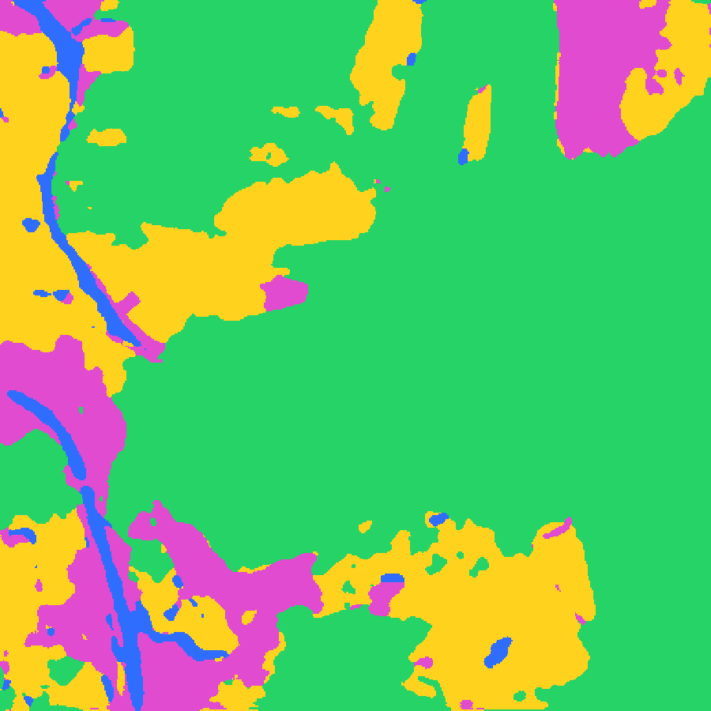

# 🛰️ ForestFellow — Land-Cover Segmentation

Turn any satellite image into a colour-coded **land-cover map** with a deep-learning
model, and measure how **forest cover** changes over time.

A **U-Net** (7-class) classifies every pixel — forest, agriculture, rangeland,
water, urban, barren, unknown — in about a second on CPU. Drag a slider to wipe
between the satellite photo and the AI map, or compare two dates side-by-side.



## Stack

| Layer | Tech |
|-------|------|
| Model | PyTorch U-Net (3→7 classes), test-time smoothing |
| API | FastAPI (`/segment`, `/health`) |
| Frontend | React + Vite + Tailwind + Framer Motion |
| Deploy | Single Docker container (FastAPI serves the built site + the API) |

## Run locally

**Backend** (Python 3.10+):
```bash
cd backend
pip install -r requirements.txt
uvicorn main:app --port 8000
```

**Frontend** (Node 20+), in another terminal:
```bash
cd frontend
npm install
npm run dev        # http://localhost:5173  (proxies /api -> :8000)
```

## Run the production container

```bash
docker build -t forestfellow .
docker run -p 7860:7860 forestfellow
# open http://localhost:7860
```

## Deploy

Pushed to a **Hugging Face Docker Space** — the `Dockerfile` builds the React app
and runs FastAPI, which serves the site and the model API from one origin.
The model weights (`trained_model.pth`, ~66 MB) are tracked with **Git LFS**.

---
<sub>Model originally trained for the ForestFellow final-year project.</sub>
